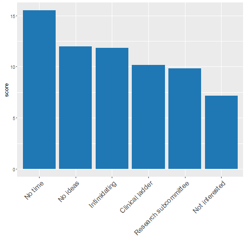
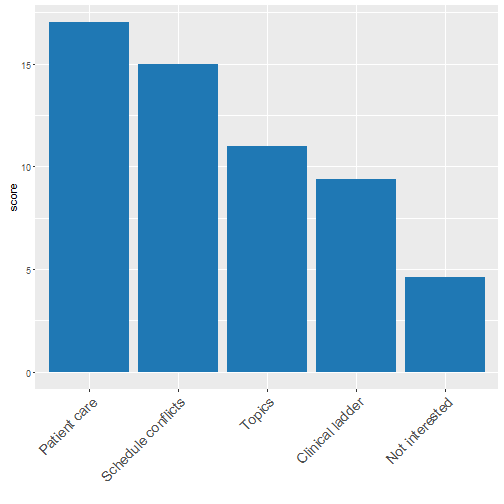
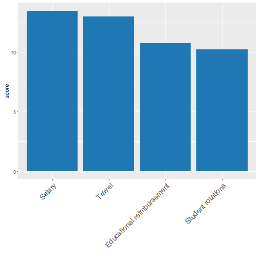

Preceptor Participation Suvery Results
========================================================
author:
date: June 17, 2016
autosize: true

Question 1
========================================================

Which of the following do you feel are barriers to precepting resident research projects?

1. Disagree with processes of research subcommittee
1. Intimidated by degree of involvement
1. No perceived benefit for clinical ladder advancement
1. No protected work time for residency projects
1. No research ideas
1. Not interested in precepting projects

Results
========================================================

Question 2
========================================================
Which of the following do you feel are barriers to attending resident presentations (short topic, seminar, and case)?

1. Patient care responsibilities
1. No perceived benefit for my position or career ladder advancement
1. Not interested in residency activities
1. Schedule conflicts with other meetings
1. Topics are not interesting

Results
========================================================

Question 3
========================================================
Which of the following would be most likely to increase your desire to participate in residency projects and presentations?

1. Merit-based salary increase
1. Travel reimbursement for educational conference(s)
1. Reimbursement for other educational expenditures (e.g., computer software, certification course, textbooks)
1. Decreased number of student rotations to offset time spent on residency activities

Results
========================================================

